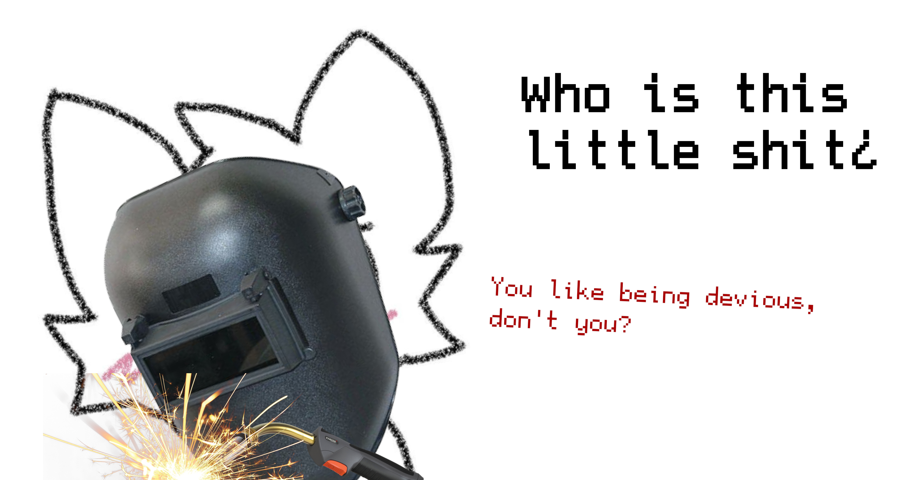

> [!WARNING]
> User is suspected to be a part of an online terrorist organization. Please report any suspicious activity to the federal boikisser security service staff.

#### Hi you lovely cuties!
The name is Mikhail :3 and sometimes i feel like programming sum fun stuff! Please do check out some of the repositories to learn more. I am just a hobbyist!

> [!NOTE]
> If you feel enraged by my existence, then I consider it a job well done!

### Active projects
Currently I am working on multiple projects listed below

| **project** | **priority** | **repository**                                                       | **status**                                                    |
|-------------|--------------|----------------------------------------------------------------------|---------------------------------------------------------------|
| safeheap    | 1            | [mikhailuwu/safeheap](https://github.com/mikhailuwu/safeheap)        |   |
| virtuanisms | 2            | [mikhailuwu/virtuanisms](https://github.com/mikhailuwu/virtuanisms)  |   |

### Coming repositories
Studies will occupy a large portion of my time, but I will try to post more repo stuff in the coming future and continue maintaining safeheap, as I feel the project is worth my time (unlike bad faith actors)!
